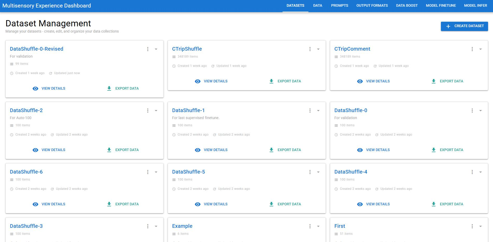
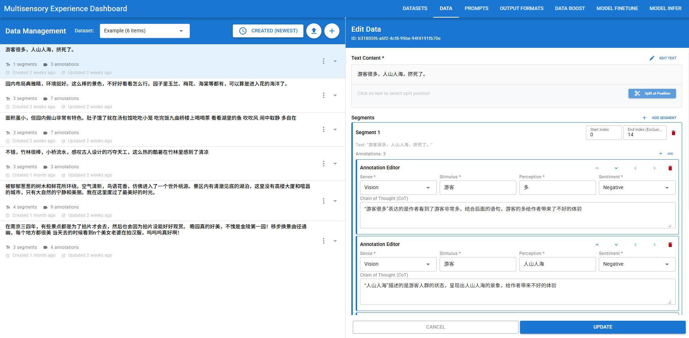
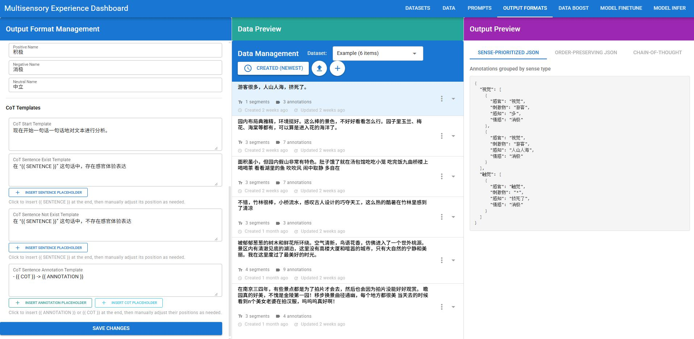
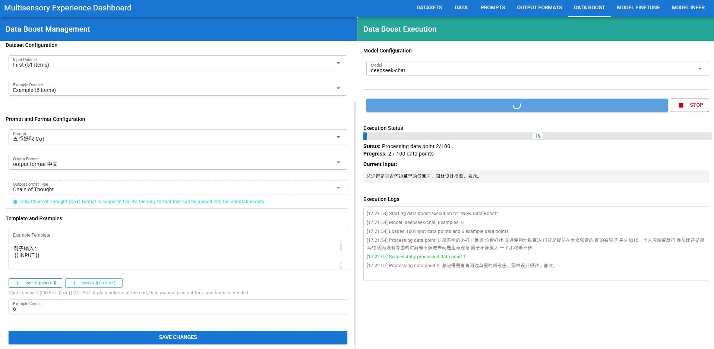
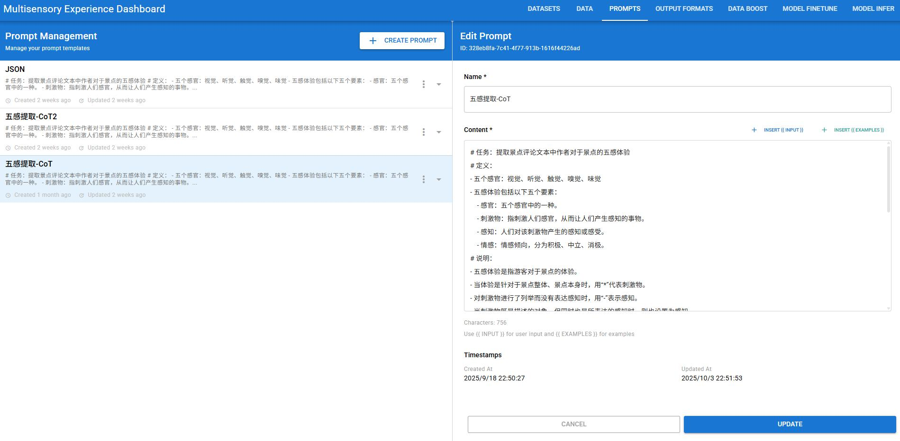
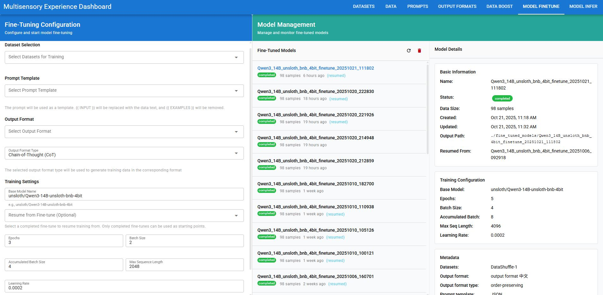
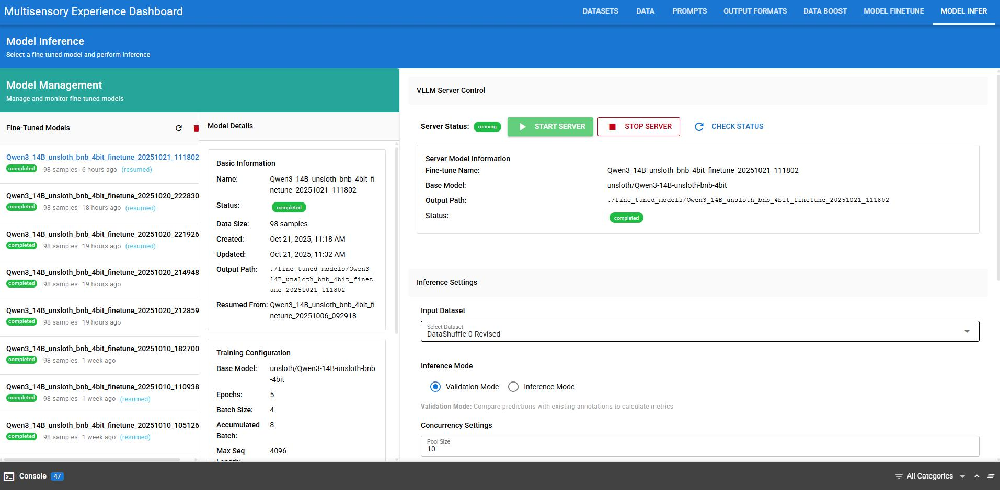

## Multisensory Experience System (MES)

<div align="center">
  
</div>

### Project Introduction

This project develops a Multisensory Experience System to enhance the efficiency, accessibility, and reproducibility of multisensory text analysis. It addresses the practical challenge where current research requires coordinating multiple, fragmented steps, leading to repetitive coding and redundant data handling.

MES consolidates the entire extraction pipeline—from annotation, data boosting, prompt design, fine-tuning, output processing, and validation—into a single, integrated platform with a unified interface. This streamlined environment eliminates technical overhead, allowing researchers and practitioners to focus on substantive work like designing annotation schemes and refining LLM prompts.

---

### Service Structure and Setup

MES consists of three services: Client, Server, and Python. Follow the steps below to install and run each service.

#### Client (Quasar + Vue 3)

Prerequisites:
- Node.js 18+ (22 recommended)
- pnpm

Install and run:

```bash
cd client
pnpm install
pnpm dev
```

The client runs at `http://localhost:9000` by default (Quasar dev server).

Build (optional):

```bash
pnpm build
```

#### Server (Node.js + Express + TSX)

Prerequisites:
- Node.js 18+ (22 recommended)
- pnpm

Install and run:

```bash
cd server
pnpm install
pnpm start
```

This starts the TypeScript server via TSX using `server.ts`. Configure environment variables as needed (e.g., MongoDB URL, API keys) using a `.env` file.

#### Python (FastAPI + ML toolchain)

Prerequisites:
- Python 3.10+
- CUDA-capable GPU for training/inference (recommended)
- MongoDB available at `mongodb://127.0.0.1:27017` (default in `python/api.py`) or override via `MONGODB_URL` environment variable

Create and activate a virtual environment (recommended), then install dependencies:

```bash
cd python
python -m venv .venv
./.venv/Scripts/activate  # Windows
pip install -r requirements.txt
```

Run the FastAPI service:

```bash
uvicorn api:app --host 0.0.0.0 --port 8000 --reload
```

Key capabilities:
- Fine-tuning with `/fine-tune`
- Managing fine-tune records in MongoDB
- Starting/stopping a vLLM inference server at `http://localhost:8001`

---

### System Features (Client-Side Focus)

Below are the main pages and features. Screenshots are located in the `Figures` directory.

#### Dataset Management
- Curate training/validation/test splits.
- Track dataset versions and metadata for reproducibility.

Image:



#### Data Page
- Import, preview, and validate datasets for multisensory text tasks.
- Supports JSON/JSONL pipeline alignment and schema checks.

Image:



Additional data import flows:


#### Output Formatting and Validation
- Transform raw outputs into structured formats.
- Validate against schemas and quality metrics.

Image:



#### Data Boost
- Apply data augmentation and bootstrapping strategies for limited labeled data.
- Visualize statistics and compare boosted vs. original distributions.

Image:



#### Prompt Design
- Iterate on prompt templates and evaluate responses.
- Compare prompt variants and pin best-performing prompts for downstream fine-tuning.

Image:



#### Model Fine-tuning
- Launch fine-tuning jobs with configurable hyperparameters.
- Monitor training status; completed models are tracked in the system.

Image:



#### Inference
- Run inference via the integrated vLLM server with LoRA adapters.
- Batch or interactive modes; export predictions for analysis.

Image:



---

### Notes and Environment Variables

- Python API defaults:
  - FastAPI: `http://0.0.0.0:8000`
  - MongoDB: `MONGODB_URL` (default `mongodb://127.0.0.1:27017`)
  - vLLM server: `http://0.0.0.0:8001`
- Server uses PNPM and TSX; see `server/package.json` for scripts.
- Client uses Quasar; see `client/package.json` for scripts.


